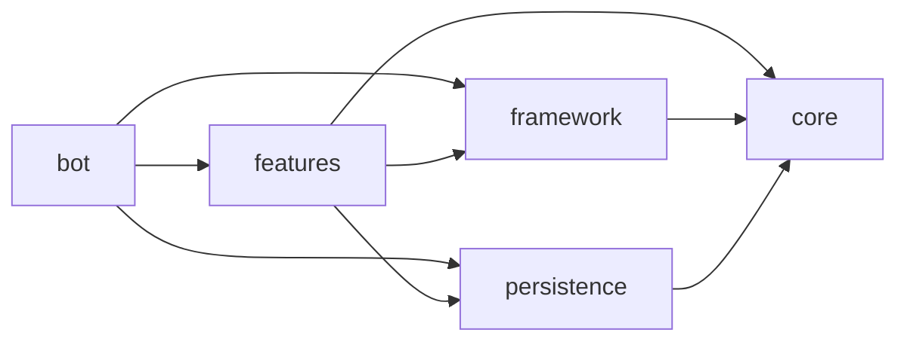

# Sentry

Last updated: September 29, 2026

This file was made entirely by generative AI. Pending human review.

Sentry is a Kotlin Discord bot built on [Kord](https://github.com/kordlib/kord). The `bot/` module is the application entry point and is organized alongside small JVM modules so domain logic, Discord integration, persistence, and features remain separately testable.

## Generative AI usage

Contributors are expected to implement functionality on their own, only using LLMs in a manner similar to StackOverflow, Google, YouTube, etc. Do not copy and paste large blocks of code from LLMs. You may use LLMs for generating documentation and tests, given that you review the output and ensure accuracy.

## Architecture

## Module map

| Module | Responsibility |
| --- | --- |
| `bot/` | Application entry point, config loading, command registration, feature installation, and login |
| `core/` | Pure domain models and profile rules; no Kord or database dependency |
| `persistence/` | SQLite-backed guild settings and pHash value storage |
| `framework/` | Shared Discord command abstraction |
| `features/` | Logging, role management, pHash matching, and welcome messaging |

The intended dependency direction is:



Features must not depend on one another. Shared code belongs in `core` or `framework`.

## Local setup

Create a new `.env` and `config.json` file in the repository root. In `.env`, add:

```
TOKEN=<your bot token>
```

In config.json, add the following:

```json
{
  "guildID": "<your guild ID>",
  "ownerID": "<your user ID>",
  "prefix": "<preferred prefix, defaults to !>"
}
```

Run the project with the repository's Kotlin toolchain. Docker builds the executable with JDK 21 and runs it on a JRE 21 image; `compose.yaml` mounts `config.json` into the container and passes `TOKEN` through the environment.

## Review sign-off

- [ ] Developer review completed
- Reviewer: ____________________
- Date: ____________________