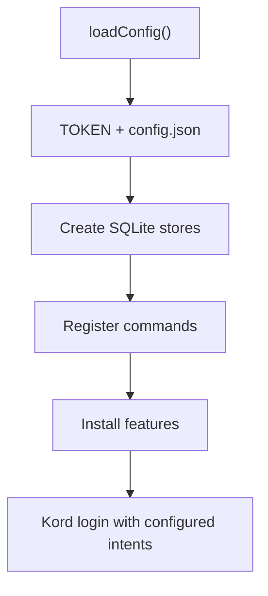

# Bot runtime

Last updated: September 29, 2026

This file was made entirely by generative AI. Pending human review.

The `bot` module is the application composition root. It loads runtime configuration, creates the persistence stores, registers slash commands, installs event-driven features, and logs the Kord client into Discord.

## Startup flow



`TOKEN` is read from the environment. `config.json` supplies `guildID`, `ownerID`, and the command prefix; the token is deliberately omitted from `Config.toString()`.

## Commands and features

The current composition registers `WelcomeCommand` and `PhashCommand`, then installs `WelcomeFeature` and `PhashFeature`. Unknown interactions are ignored; command failures are logged and returned as ephemeral error responses.

## Required configuration

Run from the repository root with:

```text
TOKEN=<your bot token>
```

and a `config.json` matching the example in the root README. Discord `MessageContent` and `GuildMembers` are privileged intents and must be enabled in the Developer Portal.

## Source layout

| File | Responsibility |
| --- | --- |
| `src/Client.kt` | Client construction, registration, handlers, and login |
| `src/Config.kt` | Environment/file configuration and intent selection |

## Review sign-off

- [ ] Developer review completed
- Reviewer: ____________________
- Date: ____________________