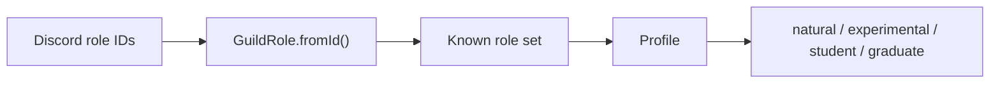

# Core domain

Last updated: September 29, 2026

This file was made entirely by generative AI. Pending human review.

The `core` module contains Discord-independent domain values used by features. It maps known Discord role IDs to `GuildRole` values and derives useful profile categories without depending on Kord, persistence, or application services.

## Profile derivation

Unknown role IDs are ignored by `Profile.fromIds`. `GuildRole` separates subject roles from background roles, while `Profile` exposes composite flags for prompt eligibility and other feature logic.

## Source layout

| File | Responsibility |
| --- | --- |
| `src/GuildRole.kt` | Role IDs, categories, and ID lookup |
| `src/Profile.kt` | Immutable role set and derived profile flags |

The module targets JVM 21 and has no Discord API or database dependency, making its rules straightforward to test in isolation.

## Review sign-off

- [ ] Developer review completed
- Reviewer: ____________________
- Date: ____________________