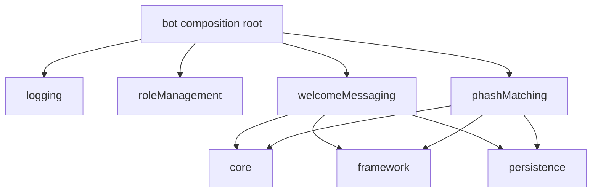

# Features

Last updated: September 29, 2026

This file was made entirely by generative AI. Pending human review.

Feature modules contain user-facing Discord behavior. Each feature is registered by `bot`, depends on shared infrastructure rather than another feature, and keeps its own commands, event handlers, and tests.

## Available features

| Feature | Purpose | Status |
| --- | --- | --- |
| `logging/` | Reserved module for Discord/application logging behavior | Scaffold |
| `roleManagement/` | Role mapping and permission-related behavior | Scaffold |
| `welcomeMessaging/` | Selects role-aware conversation starters for new members | Active |
| `phashMatching/` | Detects and moderates visually similar images | Active |

## Dependency rule

Features may depend on `core`, `framework`, and `persistence`, but never on one another. If behavior must be shared, move the shared abstraction downward into `core` or `framework`.

See the feature-specific READMEs for the welcome-messaging and pHash flows, commands, source maps, and testing notes.

## Review sign-off

- [ ] Developer review completed
- Reviewer: ____________________
- Date: ____________________