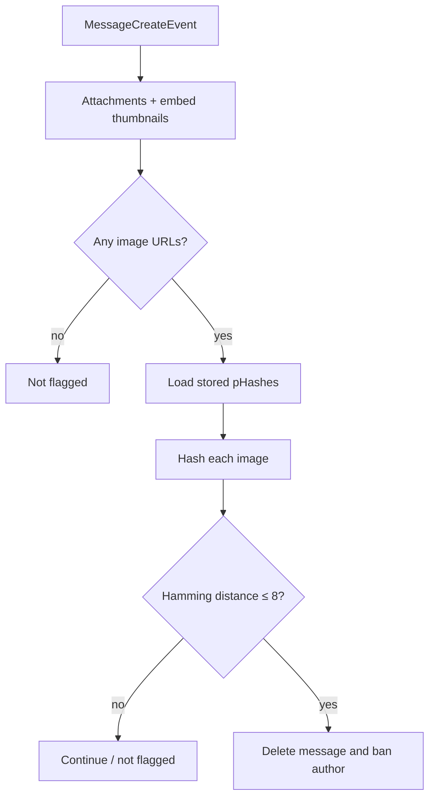

# Perceptual hash matching

Last updated: September 29, 2026

This file was made entirely by generative AI. Pending human review.

The `phashMatching` feature detects images that are visually similar to a
stored set of reference images. It monitors message attachments and embedded
thumbnails, then can delete and moderate messages that match a stored
perceptual hash. The module depends on `core`, `framework`, and `persistence`.

## How it works



`PhashFeature.build(message)` returns `true` when any decodable attachment or
thumbnail is within `HASH_THRESHOLD` (currently `8`) bits of any stored hash.
The stored hash list is loaded once per message. An undecodable image is
skipped so later images can still be checked; if every image fails to decode,
the result is `false`.

## Hash algorithm

`perceptualHash(source)` accepts a local file path or an `http://`/`https://`
URL. It:

1. loads the image with OpenCV and converts it to grayscale;
2. resizes it to `32 × 32` pixels;
3. computes the discrete cosine transform;
4. keeps the top-left `8 × 8` low-frequency coefficients;
5. applies the OpenCV/SciPy normalization correction;
6. thresholds coefficients against the median; and
7. returns 64 bits as a 16-character lowercase hexadecimal string.

`hammingDistance(a, b)` counts differing bits in two hexadecimal hashes and
rejects hashes with different lengths. A distance of zero means identical hash
bits; smaller distances indicate greater similarity.

The JVM module uses `org.openpnp:opencv:4.9.0-0`. OpenCV's native library must
be available at runtime. Tests load it locally before exercising image
operations.

## Discord command

Guild members with the Discord `Manage Guild` permission can use the global
chat-input command:

```text
/phash-matching toggle enabled:<true|false>
/phash-matching add image:<attachment>
```

`toggle` enables or disables automatic monitoring for the current guild and
responds ephemerally. `add` accepts image attachments only, defers its response
while downloading and hashing the image, and then:

- rejects non-image attachments;
- reports an error when the image cannot be processed;
- refuses to add an image already within the similarity threshold; or
- stores the new pHash in `GuildValuesStore`.

## Moderation behavior

When monitoring is enabled and a message contains a matching image,
`PhashFeature` deletes the message and bans its author. The ban includes an
appeal-oriented reason and requests deletion of the user's messages from the
previous five minutes. Hashing and matching occur before the guild setting is
checked, so the setting controls moderation rather than the `build` result
itself.

## Source layout

| File | Responsibility |
| --- | --- |
| `src/PhashMatching.kt` | OpenCV pHash generation and Hamming distance |
| `src/PhashFeature.kt` | Message inspection and moderation event handler |
| `src/PhashCommand.kt` | Toggle and reference-image commands |

## Testing

The test suite covers deterministic hash generation, hash format, common image
changes such as resizing, brightness shifts, and JPEG recompression, unrelated
images, local and HTTP sources, invalid files, Hamming-distance edge cases,
attachments, thumbnails, empty databases, undecodable images, and multiple
attachments. Run the module tests with:

```text
./kotlin test --include-module=phashMatching
```
