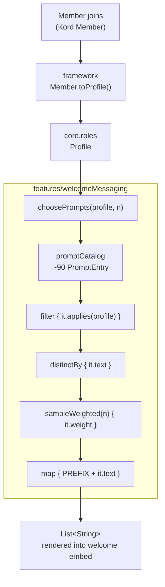
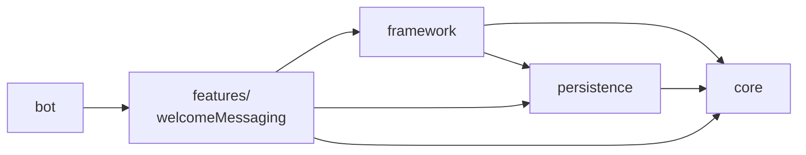
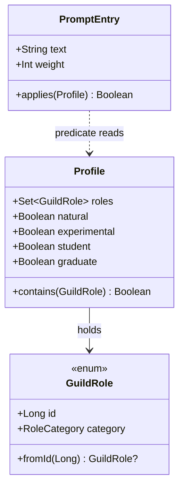

# This document has been generated by an LLM and is pending re-write.

# welcomeMessaging

Last updated: August 29, 2026

Status: In Progress

Picks a small set of conversation-starter prompts tailored to a new member's
self-assigned Discord roles.

## Flow

## Module dependencies

`welcomeMessaging` never reaches sideways into another feature. Anything two
features would share is pushed down into `core` or `framework` instead — which
is why`GuildRole`, and `Profile` live in `core` rather
than here.

## Data model

## How selection works

Every prompt carries its own eligibility predicate rather than sitting inside an
`if` block. The catalog is therefore flat data, and selection is a filter rather
than a branching tree. Adding a prompt is one line and touches no control flow.

**Weights** bias the draw without excluding anything. Defaults sit at 100.
Generic prompts drop to 65 so role-specific ones surface more often. Two
outliers are deliberate: the planetary-science opener sits at 500 to almost
always appear for that role, and the easter egg sits at 1.

**Sampling is without replacement**, so a member never sees the same prompt
twice in one message. If fewer than `n` prompts are eligible, the result is
simply shorter.

**Duplicates.** A few prompt strings appear under more than one predicate, so a
member matching both would otherwise get doubled odds. `distinctBy` collapses
them before the draw.

## Testing notes

`choosePrompts` takes a `Random` parameter so tests can seed it and assert on
exact output. Worth covering:

- A profile with no recognized roles still gets `n` prompts.
- A high-school profile never draws from the `HIGH_SCHOOL !in it` group.
- Weight proportionality — draw single prompts many times from a fixture
  catalog and assert the ratio holds.