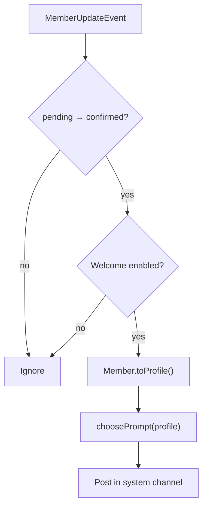

# Welcome messaging

Last updated: September 29, 2026

This file was made entirely by generative AI. Pending human review.

The `welcomeMessaging` feature sends new guild members a short set of
conversation starters selected from their Discord roles and profile attributes.
It depends on `core` for `Profile`, `framework` for bot integration, and
`persistence` for the per-guild feature setting.

## User flow

1. A member finishes Discord's pending-member state.
2. `WelcomeFeature` converts the member's role IDs into a `Profile`.
3. `choosePrompt` filters and samples three eligible prompts by default.
4. The feature posts the member mention and prompts in the guild's system
   channel.

The message is sent only when the feature is enabled for that guild and a
system channel is available. A member update that does not transition from
pending to confirmed is ignored.


```mermaid
flowchart TD
    A["MemberUpdateEvent"] --> B{"pending → confirmed?"}
    B -- no --> X["Ignore"]
    B -- yes --> C{"Welcome enabled?"}
    C -- no --> X
    C -- yes --> D["Member.toProfile()"]
    D --> E["choosePrompt(profile)"]
    E --> F["Post in system channel"]
```

## Prompt catalog

Prompts are `PromptEntry` values in `PromptCatalog.kt`:

```kotlin
PromptEntry(
    text = "💻 What area of computer science do you think is most underexplored?",
    weight = 100,
    applies = { core.GuildRole.COMPUTER_SCIENCE in it },
)
```

Each entry contains:

- `text`: the conversation starter shown to the member;
- `weight`: its relative probability during sampling;
- `applies`: a predicate over the member's `Profile`.

The catalog includes general, subject-specific, composite, student, graduate,
and background prompts. Predicates can inspect recognized `GuildRole` values as
well as profile flags such as `natural`, `experimental`, `student`, and
`graduate`.

## Selection algorithm

`choosePrompt(profile, n, random)` performs these operations:

1. Keep entries whose `applies` predicate accepts the profile.
2. Remove duplicate prompt text so an entry shared by multiple predicates does
   not receive extra odds.
3. Sample up to `n` entries using their positive weights, without replacement.
4. Prefix every selected prompt with the feature's display indentation.

The default selection count is three. A negative count is rejected, and a
non-positive prompt weight makes that prompt ineligible. If fewer than `n`
eligible entries remain, all available entries are returned. The default
weights are `100`; generic prompts use `65`, the planetary-science opener uses
`500`, and the rare easter egg uses `1`.

## Configuration command

Guild members with the Discord `Manage Guild` permission can use the global
chat-input command:

```text
/welcome-messaging toggle:<true|false>
```

The command persists the setting through `GuildConfigStore` and responds
ephemerally with either `Welcome messages on.` or `Welcome messages off.`

## Source layout

| File | Responsibility |
| --- | --- |
| `src/WelcomeFeature.kt` | Member event handling, profile conversion, and message construction |
| `src/WelcomeCommand.kt` | Guild setting command |
| `src/PromptCatalog.kt` | Prompt entries, weights, and eligibility predicates |
| `src/PromptSelection.kt` | Filtering, de-duplication, and formatting |
| `src/WeightedSample.kt` | Weighted sampling without replacement |

## Testing considerations

Selection tests should use the injectable `Random` parameter and cover profile
eligibility, duplicate removal, weight handling, zero and negative counts, and
the shorter-result behavior when the eligible pool is small. Feature tests
should cover the pending-to-confirmed transition, disabled guilds, missing
system channels, and the generated message format.

## Review sign-off

- [ ] Developer review completed
- Reviewer: ____________________
- Date: ____________________