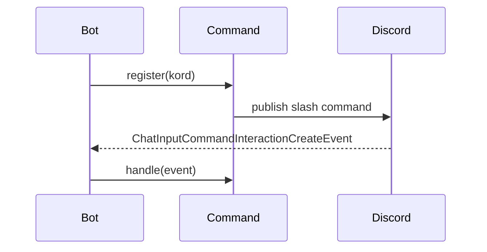

# Framework

Last updated: September 29, 2026

This file was made entirely by generative AI. Pending human review.

The `framework` module provides the small integration contract shared by feature commands. Its `Command` interface separates Discord command registration from command execution while keeping feature implementations responsible for their own behavior.

## Command lifecycle

Every command supplies a `name` and `description`, then implements suspendable `register` and `handle` operations. The bot indexes commands by root name and routes incoming interactions to the matching implementation.

## Source layout

| File | Responsibility |
| --- | --- |
| `src/Command.kt` | Shared slash-command interface |

The module targets JVM 21 and depends on Kord plus `core`.

## Review sign-off

- [ ] Developer review completed
- Reviewer: ____________________
- Date: ____________________