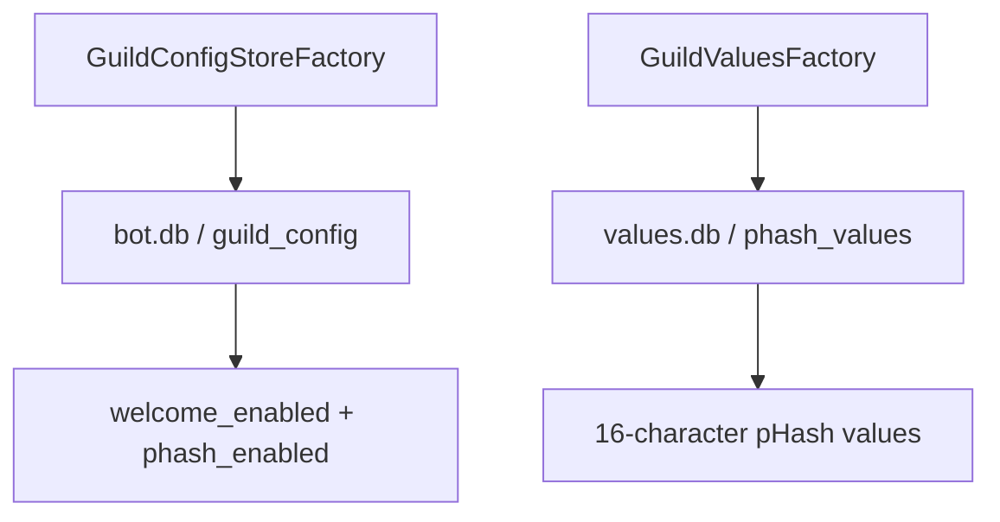

# Persistence

Last updated: September 29, 2026

This file was made entirely by generative AI. Pending human review.

The `persistence` module provides SQLite-backed stores behind small interfaces. It keeps guild feature settings and reference pHashes out of Discord event handlers and exposes suspendable operations for database access.

## Storage flows

`GuildConfigStoreFactory.create()` initializes `bot.db` by default. `GuildValuesFactory.create()` initializes `values.db` and returns the pHash value store. Both factories accept a path for tests or alternate deployments.

## Interfaces

| Type | Responsibility |
| --- | --- |
| `GuildConfigStore` | Read and toggle per-guild welcome and pHash settings |
| `GuildValuesStore` | Read and add stored pHash strings |
| `GuildConfigStoreFactory` | Connect to and initialize guild configuration storage |
| `GuildValuesFactory` | Connect to and initialize pHash value storage |

Database work for values uses Exposed suspended transactions on `Dispatchers.IO`. The current configuration read methods are not yet implemented; treat that limitation as part of review before production use.

## Source layout

| File | Responsibility |
| --- | --- |
| `src/ConfigStore.kt` | Guild settings schema and store implementation |
| `src/GuildConfigStore.kt` | Guild settings interface and factory |
| `src/ValuesStore.kt` | pHash schema and SQLite implementation |
| `src/GuildValuesStore.kt` | pHash value interface and factory |

## Review sign-off

- [ ] Developer review completed
- Reviewer: ____________________
- Date: ____________________